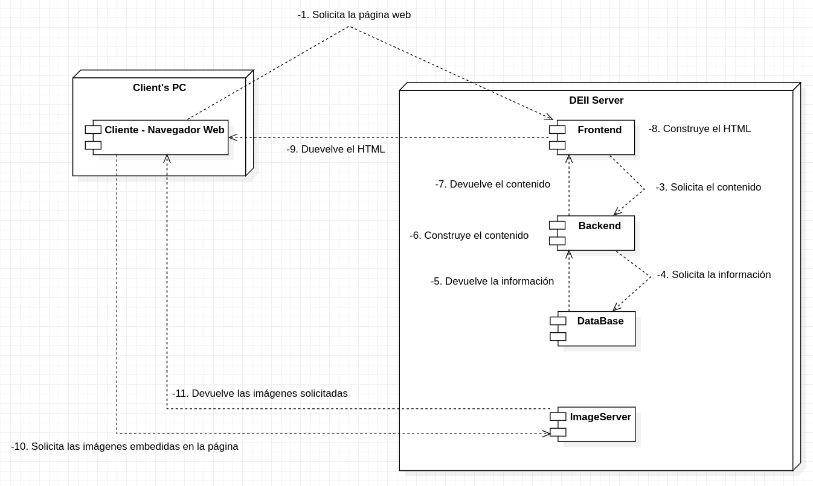
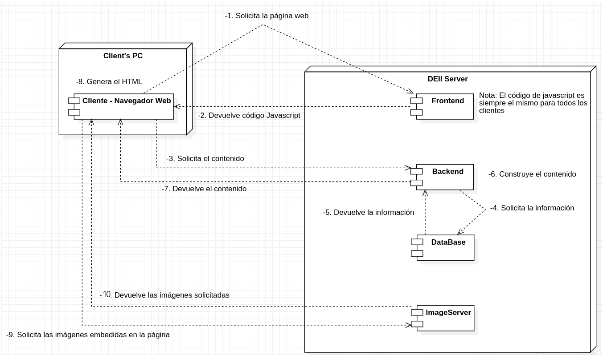
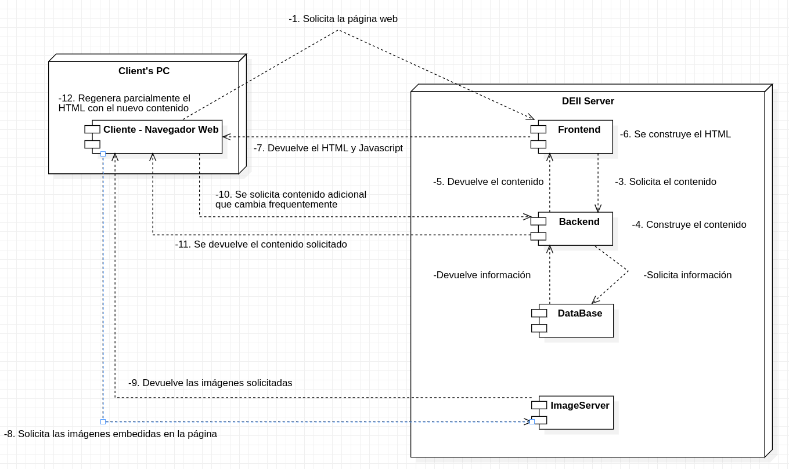
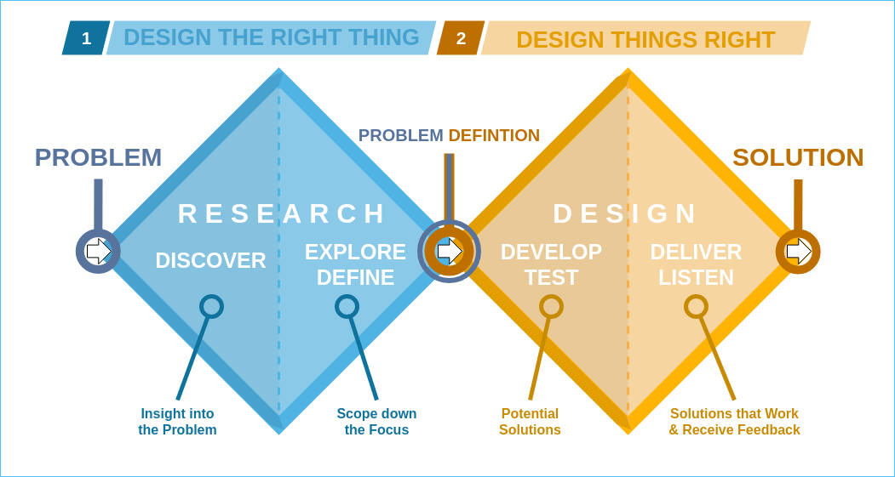
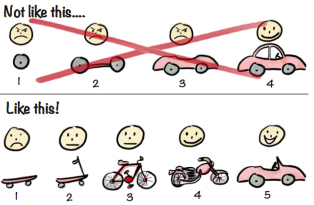
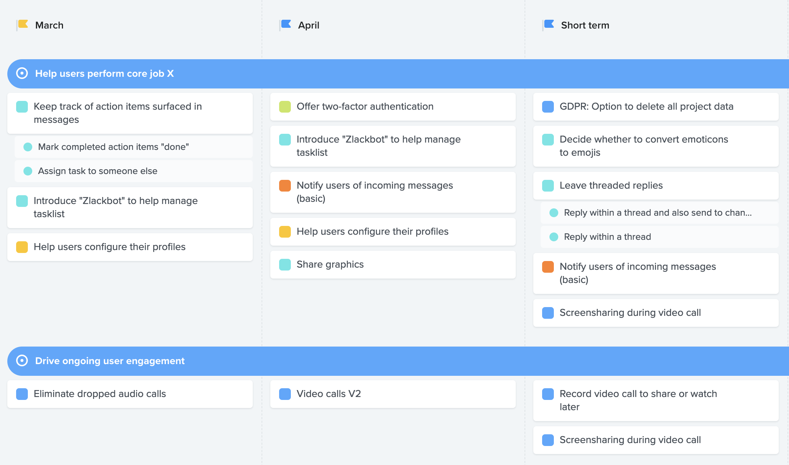
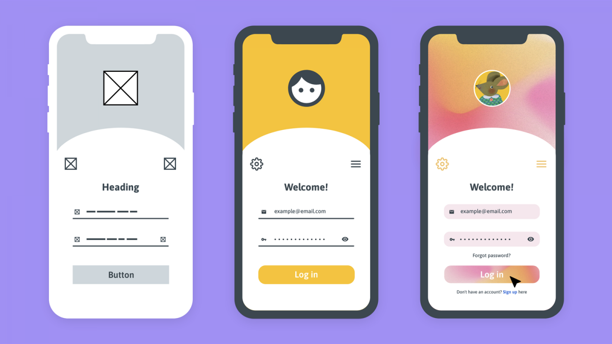
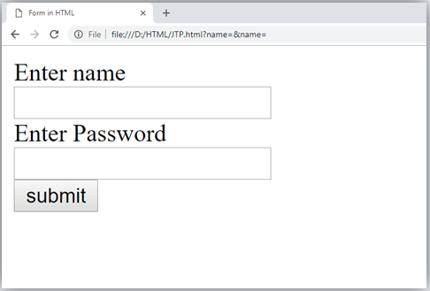

# **La guía del desarrollador web galáctico 🚀**

Bienvenidos a la guía definitiva de la DEII para entender de una vez por todas el mapa general del desarrollo web. Pero no cualquier desarrollo web, sino el desarrollo web **GALÁCTICO.**

Pero tranquilo astronauta, sabemos que no quieres marearte en tu primer viaje a si que vamos a ir, como dice fonsi, des pa ci to.

el único objetivo de esta guía es que cuando la termines tengas un mapa en la cabeza de como funciona el desarrollo web y puedas comenzar a trabajar.

Comencemos pues!

3, 2, 1... Despegue!!!!!!!


# Índice

1. [Infraestructura: El mapa](#infraestructura-el-mapa)
2. [Producto: Del problema a la solución](#producto-del-problema-a-la-solución)
3. [Frontend: Del prototipo a una aplicación real](#frontend-del-prototípo-a-una-aplicación-real)
4. [Backend: Dónde ocurre la magia](#backend-dónde-ocurre-la-magia)
5. [Sistemas: Linux uwu](#sistemas-linux-uwu)

<br>

# Infraestructura: El mapa

Buenas aspirante. Antes de poder embarcarte en tu viaje a través de la galaxia para 
convertirte en el desarrollador web definitivo vas a tener que familiarizarte con los
protocolos de seguridad de la nave ¿No pensarías que puedes subirte a una nave espacial
sin tener ni pajorera idea, no?

A continuación vamos a atravesar una nebulosa conceptual que describe el desarrollo web
desde el comienzo a hasta las técnicas modernas y que se utilizarán para desarrollar la página web de la delegación.


## El modelo cliente/servidor 
<br>

La forma más básica de realizar cualquier tipo de comunicación en internet es 
siguiendo el modelo cliente/servidor. En primer lugar, el **cliente** realiza una
petición y, posteriormente, el **servidor** le responde.

```
Cliente               Servidor
   |     Solicitud       |
   | ----------------->  |
   |                     |
   |     Respuesta       |
   | <-----------------  |
```

El punto a recordar es que la interacción siempre la inicia el cliente mientras que
el servidor espera pacientemente una solicitud.

## HTTP

Ahora que hemos hablado de la principal forma en que dos máquinas se envían mensajes 
deberíamos hablar del formato de estos.


El protocolo [HTTP](https://en.wikipedia.org/wiki/Hypertext_Transfer_Protocol) es, 
de forma muy reducida, el formato con el que se envían todos los mensajes a través de
internet. Ejemplos del uso de HTTP son envíar un formulario de inicio de sesión o el código fuente de una página web (HTML, del que hablaremos más adelante).

Un mensaje HTTP está formado por dos partes.
- **La cabecera del mensaje** contiene metadatos como el 
[tipo de mensaje](https://en.wikipedia.org/wiki/Hypertext_Transfer_Protocol#Request_methods)
 o el formato de los datos enviados (JSON, CSV, HTML, etc).
- **La carga del mensaje**, o payload, son los datos que se quieren envíar. No todos 
los mensajes HTTP requieren de este campo de forma que es opcional.

Es importante mencionar que el protocolo HTTP sigue el modelo cliente/servidor de
forma que todas las comunicaciones comienzan con una solicitud, HTTP Request, (Por 
ejemplo: GET, que se utiliza para solicitar infomación o PUT, que se suele utilizar 
para actualizar información) y terminan con una respuesta, HTTP Response, que 
contiene un código numérico indicando éxito o, en caso de fallo, la razón del error. 

Tanto la solicitud como la respuesta podrían incluir un payload, por ejemplo:
- La solicitud podría contener la información de inicio de sesión.
- La respuesta podría contener la información del usuario que ha iniciado sesión.

## La página web tradicional

En un principio, las páginas web eran [estáticas](https://en.wikipedia.org/wiki/Static_web_page). 
El cliente, en este caso un navegador web, solicitaba al servidor una página web y 
este responde con el código que representa la página (HTML) que el navegador puede 
utilizar para generar la vista que finalmente se entiende por la página. 

Se les llama estáticas porque el código HTML se aloja en el servidor de la misma
forma en la que se va a envíar al usuario y todos los clientes reciben la exacta 
misma copia.

```
Cliente               Servidor
Firefox                Google
   |     Solicitud       |
   | ----------------->  |
   |                     |
   |     Página web      |
   | <-----------------  |
```

Ahí se quedaba la cosa, nada de aplicaciones en tiempo real como WhatsApp Web.

## Páginas webs dinámicas: Renderización

Con el tiempo surgió la necesidad de personalizar las páginas webs en función del 
cliente para mostrar, por ejemplo, la lista de la compra de un usuario en particular.
Para conseguir este objetivo el código HTML se escribe de forma genérica 
(Con variables, bucles, condicionales, etc.) y, posteriormente, se transforma en una 
página estática a partir de los datos correspondientes (Como el usuario o el catálogo de una tienda).

Algunas de las tecnologías que permiten seguir este modelo son 
[JavaServer Pages](https://en.wikipedia.org/wiki/Jakarta_Server_Pages), 
[PHP](https://en.wikipedia.org/wiki/PHP), 
[Angular](https://angular.io/) 
y, la que nosotros utilizaremos, [Next](https://nextjs.org/).

A este proceso se le conoce como renderizado, en el contexto del desarrollo web, y existen
varias formas de realizarlo:

### Server Side Rendering (SSR)

El proceso de renderización se lleva a cabo en el servidor. Bastante sencillo, ¿No?

```
Cliente               Servidor
   |     Solicitud       |
   | ----------------->  |
   |                     |
   |               Renderización
   |                     |
   |     Página web      |
   | <-----------------  |
```

Después de recibir la solicitud el servidor transforma el HTML genérico en uno 
personalizado para el cliente en cuestión y, una vez completado el proceso, devuelve
la página estática. Ejemplos de SSR son JavaServer Pages y PHP.

**Ventajas**:
- El cliente recibe todo el HTML generado lo que facilita un mejor ranking en la 
página de búsquedas de google ([SEO](https://en.wikipedia.org/wiki/Search_engine_optimization)). 
Y esto no es poca cosa.

**Desventajas**: 
- La carga computacional de renderización puede saturar al o los servidores.
- Hace falta refrescar la página cada vez que se desea actualizar el contenido. Las 
solicitudes recurrentes saturan a la red y los servidores, más aún si el HTML generado
es extenso.

### Client Side Rendering (CSR)

Bueno pues lo mismo pero al revés, ¿No? Ciertamente la idea es la misma aunque no es 
tan trivial darle la vuelta, al fin y al cabo, ¿Como puede el cliente renderizar una 
página web que no conoce? 

La respuesta a esto es [Javascript](https://en.wikipedia.org/wiki/JavaScript): En 
lugar de responder con un archivo HTML el servidor devolverá código javascript capaz
de construir la página por sí mismo.

```
   Cliente               Servidor
      |     Solicitud       |
      | ----------------->  |
      |     JavaScript      |
      | <-----------------  |
      |                     |
Renderización               |
      |                     |
```

Un ejemplo de CSR es Angular.

**Ventajas**:
- Permite actualizar el contenido de la página sin necesidad de refrescar. Esto lo 
conviene en la opción idónea para aplicaciones altamente interactivas, imagina que 
tuvieras que refrescar la página para ver cada mensaje que te llega nuevo a Whatsapp 
Web.
- Libera carga del servidor.

**Desventajas**:
- Tiene muy mal [SEO](https://en.wikipedia.org/wiki/Search_engine_optimization) 
puesto que el HTML está vacío en un principio lo que le dificulta a google posicionar
tu página.

### Hybrid Rendering 

Como el nombre indica, consiste en hacer las dos cosas a la vez. Una parte de la 
página se renderizará en el servidor y otra en el cliente.

```
   Cliente               Servidor
      |     Solicitud       |
      | ----------------->  |
      |                     |
      |               Renderización 
      |                     |
      |  HTML y JavaScript  |
      | <-----------------  |
      |                     |
Renderización               |
      |                     |
```

Este acercamiento nos permite escoger a voluntad, para cada caso, la solución que 
mejor se adapte. Por ejemplo la gran parte de la página es poco interactiva y su 
contenido no cambia a menudo de forma que la renderizamos en el servidor, sin embargo,
la aplicación tiene un chat de atención al cliente, esta parte que es altamente 
interactiva la renderizamos en el cliente.

De esta forma obtenemos un mejor [SEO](https://en.wikipedia.org/wiki/Search_engine_optimization) 
sin la necesidad de sacrificar toda interactividad.

## El verdadero mapa

He de admitir que hasta ahora he estado mintiendo, bueno más bien he ocultado parte 
de la verdad. Por la imagen que se ha pintado hasta el momento parece que hay dos 
agentes que interactuan: el cliente y el servidor, sin embargo, en realidad son cinco agentes
los interactuan en una página web moderna.


### 1. El cliente
Este sigue siendo el navegador web del usuario que quiere acceder a la página. Nada ha
cambiado.
<br>


### 2. El servidor de frontend
Frontend de aquí en adelante, es el servidor que hemos estado viendo hasta ahora. Se encarga de devolver el HTML (SSR) o el javascript (CSR) al cliente cuando este se conecta por primera vez
a la página web.
<br>


### 3. El servidor de backend
Backend de aquí en adelante, es el servidor que hemos estado ocultando hasta ahora. 
En pocas palabras es el encargado de generar el contenido de la página web. 
Abstrae la lógica de negocio haciendo de interfaz entre la base de datos y el 
frontend. El frontend (SSR) o el cliente (CSR) se comunican con este servidor para
obtener la infomación necesaria para renderizar la página.
<br>


### 4. Base de datos 
Se trata de una máquina que ejecuta un [DBMS](https://en.wikipedia.org/wiki/Database#Database_management_system) y a la cual solo se debería poder acceder 
a través del backend por motivos de seguridad.
<br>

### 5. Servidor de imágenes
Se trata de un servidor de archivos estáticos. Aunque en realidad este tipo de 
servidores se pueden utilizar para almacenar cualquier tipo de archivo lo normal 
es utilizarlos para almacenar las imágenes a las que la página web hace referencia
a través de URLs.
<br>

----

A continuación se muestran los **verdaderos diagramas de los diferentes modelos de 
desarrollo web**. Se utiliza como ejemplo un cliente cualquiera y el servidor la delegación. Los contenedores representan las máquinas físicas mientras que los 
componentes dentro de estas representan procesos. 

### SSR 



### CSR 


Los pasos 3. y 7. pueden llevarse a cabo multiples veces
a medida que haga falta actualizar información.

### Hybrid Rendering 


Los pasos 10. y 11. pueden llevarse a cabo multiples veces
a medida que haga falta actualizar información.

# Producto: Del problema a la solución

Bueno viajero, que tal ha ido tu primer expedición? Tienes un poco cara de mareado. Pero bueno, tranquilo que has aterricado en el planeta más alucinante de todos. El planeta **Producto**. 

Te noto aturdido, te estarás preguntando ¿Qué es producto? Producto es todo y nada, es el infinito y el cero. Uhum Uhum... vale me dejo de tonterías. Producto es el area de una empresa que se encarga de ser intermediario entre el equipo de desarrollo y el equipo de negocio. Transforma las ideas locas de una empresa en prototipos viables listos para programar, midiendo el impacto real de los mismos una vez entregados al cliente final. 

Sin un departamento de producto muy bueno, es muy difícil que una empresa o Startup funcione. Es por ello que muchos VCs (Venture Capital) o BA (Business Angels) solo invierten en startups coon equipos de producto de renombre o que hayán demostrado capacidad para innovar y aportar valor. Un ejemplo de este tipo de VC es Itnig de Barcelona.

Las funciones que realizan los perfiles de este tipo son:
- Identificación de problemas (pains) de nuestro cliente
- Ideación de funcionalidades que solventen esos problemas
- Priorización de esas funcionalidades.
- Diseño de un prototipo que cumpla con las especificaciones.
- Testeo y evaluación del rendimiento de nuestro prototipo.
- Delivery final al equipo de desarrollo.

Este flujo sigue el esquema llamado "Double Diamond Design Process"



Dentro de producto como os podreis imaginar hay varios roles: (estos roles suelen ser variables al igual que su función en la empresa)
- Product Manager
- Product Designer
- Product Marketer
- Business Analyst
- Chief Product Officer
...

nosotros nos centraremos en dos de ellos, el Product Manager y el Product Designer.

## Product Manager:

El Product Manager se encarga de la primera fase del diseño: research de problemas y priorización de funcionalidades.

Hay dos reglas que todo Product Manager debe marcarse en la sangre:

1. No creer nada hasta que no lo pruebes (A.K.A Lean Startup).
2. Tomar decisiones en base a datos (A.K.A Data Driven Decisions o en su abreviación DDD).

Su primer labor será hacer research del sector en el que se mueve, encontrando y verificando los problemas reales del cliente. Para esto puede apoyarse de metodologías como Lean Startup. Qué por cierto es la metodología que ha llevado Silicon Valley a donde esta ahora mismo. Esta se basa en el ciclo hipótesis, test y aprendizaje descrito en la imagen posterior.


Dentro de Lean Startup nos dan un consejo muy importante a la hora de definir y desarrollar un producto/funcionalidad. Crear MVPs e irlos iterando hasta alcanzar la versión final. ¿Esto que quiere decir? Imaginemos que el producto que queremos desarrollar es un coche, el coche tiene como objetivo llevar a Rubén desde Tafira (Punto A) hasta Las Palmas (Punto B) para ir al peluquero (que ya le hace falta). Como personas de producto podríamos hacer dos cosas:
1. Decirle al equipo de dearrollo que haga primero las ruedas, después el carenado, después el motor... y a lo mejor en 3 años tenemos el coche listo
2. Empezar por construir un patinete en 1 día, después una bicicleta, después una motocicleta y por último ya el coche.

La diferencia entre el método 1 y el método dos esque si optas por el 1, tardarás 3 años en darte cuenta que rubén no se corta el pelo (su pelo es una objeto inmutable) y en el segundo 1 día. 

A donde va esta metafora: es mejor crear productos que consigan, aunque de forma pobre, solucionar el problema de tu cliente desde el minuto 1, y después irlos iterando con el paso de tiempo, que hacer funcionalidades de forma muy perfeccionista para acabarte dando cuenta que el cliente no tiene ese problema y te has equivocado de antes.



Su segunda función es idear funcionalidades que solventen los problemas encontrados, priorizandolas según su importancia. Una heurística, muy sencilla, pero popular, para hacer esto es usar la matriz effort/value que nos permite en muy poco tiempo identificar aquellas que aporten mas valor con el mínimo esfuerzo (Principio de Pareto). El output de esta fase deberá de ser un Product Roudmap, que se puede crear con Jira, Product Board o cualquier otro software pero la idea es que todo el equipo sepa que funcionalidades se van a desarrollar a largo plazo y que prioridades tienen. Mas tarde estas funcionalidades se convertiran en epics que el equipo de desarrollo tendrá que implementar.


Mensaje muy importante!!! A la hora de definir una funcionalidad, sobretodo si esta es muy ambiciosa, es importante que se haga en interaciones de MVPS. Para empezar hablemos de que es 

Este es un ejemplo de roadmap de producto realizado dentro del software productboard.



Aquí terminá el trabajo del Product Manager y comienza el del Product Designer, aunque oviamente el Product Manager seguirá al tanto de todo el ciclo de desarrollo para comprobar que este yendo todo de la mejor manera posible.

## Product Designer:

El product designer se encarga de la segunda fase del diseño: definir una funcionalidad y crear el prototipo final. Este prototipo será de alta fidelidad (High Fidelity) y se le entregará al equipo de desarrollo para que lo implemente. P.D: No cambies un prototipo final al no ser que quieras que algún frontend tire tu ordenador por la ventana un martes por la mañana.

Las fases de este proceso son 4:
1. Research e Inspiración: donde se tratará de buscar aplicaciones con funcionalidades parecidas, diseños ya echos por otros... (Dribbble es la herramienta que mas se usa para esta fase)
2. Crear Wireframes: Los wireframes son el esqueleto de nuestro diseño, nos indican la posición de los elementos, los CTAs (call to actions), información contenida dentro de los mismos pero sin ningún tipo de estilo.
3. Pasar los Fireframes a Mockups: es decir darle estilo a estos Mockups a través del sistema de diseño de nuestra organización
4. Protipar: craer un prototipo que el equipo de desarrollo usará para comenzar a trabajar.

Todas y cada una de estas fases hay que validarlas con el equipo y con cliente final para asegurar que todo vaya bien. También si quieres poner cosas fancy hablate con el equipo de front para que te digan que pueden o que no pueden hacer, ya que es probable que si les pones a hacer un blur con fueguitos artificiales te acaben crucificando.


Wireframe, Mockup, Prototipo de Alta Fidelidad.

las principales subcategorias del mismo son:
- UX Designer: Encargados de desarrollar los wireframes.
- UI Designer: Encargados de pasar los wireframes a mockups.


# Frontend: Del prototípo a una aplicación real

Es hora de hablar del frontend, la programación para los brogrammers, esos seres de luz que a pesar de programar 10h al día estan mamados se despiertan a las 5 am y lo primero que hacen es tomarse un batido de proteínas. 

Empecemos por lo básico. 

**¿Qué es el frontend?**

El frontend no es nada más que la interfaz de usuario que el cliente ve en su ordenador cuando entra a nuestra página/app web. Esta interfaz la construye el navegador a través del js, html, y css entregado por el servidor. Así es, el navegador no es nada más que un programita que sabe interpretar todos esos archivos. Es más, seguro que eres un curioso y has echo click derecho alguna vez en una página web y le has dado a inspeccionar. Vaya traviesillo.

Si haces eso ahora mismo veras por una parte primero el html de la página, después si clicas en un elemento veras su css, y por último arriba tendrás un apartado que se llama consola, donde podrás ejecutar ordenes en javascript. Así es, los navegadores incluyen dentro un interprete de js. El más popular hoy en día es el V8 creado por google e incluído en google-chrome, opera, brave, ms edge... Este interpreté es el mismo que tiempo después de su creación, un equipo de desarrolladores tubieron una idea curiosa, sacarlo del navegador y distribuírlo como un programa independiente. Y así fué como nació "nodejs".

## HTML

Bueno volvamos a la conversación. Empecemos hablando de HTML. HTML es un lenguaje de etiquetas es decir, no, no es un lenguaje de programación. Se compone de una seríe de tags que van anidandose unos dentro de otros en forma de árbol como podeis ver en la imagen de abajo. Todos estos tags tienen dos propiedades siempre que nos van a ser de mucha utilidad, una la id, y otra la class (clase). Nota. Id solo puede haber una, pero clases le podemos específicar muchas a nuestro elemento separadas por espacios.

```
<html>
   <head>
   </head>
   <body>
      <h1 id="title" class="title other">Hello world</h1>
   </body>
<html>
```
HTML incluye bastantes tags para hacernos la vida mas fácil, como por ejemplo crear formularios (Una cosa que cómo frontend harás un septillón de veces) a si que usalos que Tim Berners-Lee no los ha puesto ahí para que los ignores. 
   
```
<form action="/action_page.php">
  <label for="name">Enter name:</label><br>
  <input type="text" id="name" name="name" value=""><br>
  <label for="passwd">Enter password:</label><br>
  <input type="password" id="passwd" name="passwd" value=""><br><br>
  <input type="submit" value="Submit">
</form>
```

Esto nos crearía un formulario tal que así:



Es importante usar los tags correctamente ya que afectara al posicionamiento de nuestra página en google, la accesibilidad de la misma, la legibilidad de nuestro código etc... Al uso correcto de estos tags se llama HTML semántico.

Como bien decíamos al final en un html estamos definiendo un árbol donde los padres son los contenedores y los hijos los contenidos. Aquí entra el concepto de DOM (Document Object Mapping). el DOM es la estructura de datos en forma de árbol que almacena nuestro navegador para representar la interfaz que vemos. cómo todo árbol el DOM cuenta con nodos, los cuales vendrían a ser cada uno de los tags que hemos escrito en nuestro html. Podemos acceder a este DOM a través de la DOM API que nos brinda el navegador para modificarlo como queramos usando javascript. La ventaja de javascript es que podemos sin necesidad de volver a pedir otro html al servidor actualizar la interfaz adecuandala a nuestras necesidades de forma interactiva. Pero de este hablaremos más delante

## CSS

Bueno, seguramente, cuando hayas visto el formulario que he puesto arriba te ha dado cancer en los ojos de lo feo que és no? Pues aquí viene nuestro amigo CSS a salvarnos el culo. Para añadir css solo tendremos que crear un archivo con la extensión *.css y referenciarlo en el html, en el head (también puedes añadir inline styles o meter el css dentro del html pero hazlo solo si quieres que te dispare con una pistola en la cabeza yo personalmente). CSS aunque parezca raro si que es un lenguaje turing completo, aunque no nos vamos a parar en esto. Su principal utilidad es definir los estilos de nuestro html para que quede bien bonito. El código css se compone de primero una referencia al elemento que puede ser en forma de clase o id. Si es una clase pondremos un . delante del nombre, en cambio si es un id pondremos el #. Después añadiremos llaves y dentro pondremos todo el estilo

```
.objeto{
   color: red;
   background-color: blue;
   font-size: 1.3em;
}

```
Como veis tiene un gran número de propiedades que podemos modificar de nuestro elemento. Desde color, fuentes etc... También nos permité declarar variables, útiles para reciclar colores por ejemplo, realizar imports y separarlo por partes etc...  Pero como veis aunque seán buenas funcionalidades son un poco "boilerplate" es por eso que para nuestro proyecto envez de css a pelo usaremos SaaS.

```
:root {
  --blue: #1e90ff;
}

body { background-color: var(--blue); }
```

** SASS **

No voy a hablar mucho de el, solo comentar algunas de sus ventajas ya que esto es una guía introductoria. SaaS permite entre otras funcionalidades: herencia de estilos al mas puro estilo POO, uso de modulos independientes, variables fáciles de declarar, anidación de elementos unos en otros, código más legible etc...

Voy a poner un cacho de código SaaS haciendo declarando variables para que veaís la diferencia. 

```
$border-dark: rgba($base-color, 0.88);

.alert {
  border: 1px solid $border-dark;
}
```
Mucho más sencillo que usar el var ese por ahí enmedio y el :root no? Lo guapo de sass esque todo el css que escribas es totalmente compatible y funciona en un documento tipo .scss (Una de las extensiones que permite sass) oesa que es la leche.

## Javascript

Okey, vamos con ahora sí, un lenguaje de programación de verdad, turing completo y todas esas cosas. Javascript. Su nombre nos hace pensar en la programación orientada a objetos de Java, un estilo tipado, escalable... Pues todo lo contrario, javascript ni es orientado a objetos como tal, ni es tipado ni nada. Hablemos de sus carácterísticas.

Carácteristicas:
- Alto nivel, muy fácil de aprender
- Tiene tipado dinámico, no hace falta tipar.
- Los objetos son prototípos (este es un concepto complicado de entender, no lo explicaré aquí).
- Paradigma totalmente funcional, y a mi juicio bien implementado. 
- Single Threaded aunque admite algo parecido a la concurrencia pero sin paralelismo.
- Es capaz de acceder al DOM y modificarlo a su gusto.

lenguajes:

framework: coge tu código y lo transforma en javascript, html y css tradicional. encambio la libreria la llamas

html: etiquetas, es un arbol se llama DOM. 
css: define estilos para esas etiquetas.
javascript: introducción, paradigma funcional es6, (!yuju existen clases pero no son objetos! prototype), parece concurrente pero es single threaded surprise motherfucker (event loop). 

nosotros usaremos next implementa react como librería.

# Backend: Dónde ocurre la magia

python: 
https:
lenguaje: de verdad herencia (!puto self) y programacion funcional (lambdas) en armonia perfecta, si lo necesitas metes c++
postgres
ORM

# Sistemas: Linux uwu

Vaya o eres muy curioso/a o definitivamente sois los pibes de sistemas. 

Bienvenidos al corazon de la máquina. El explorador espacial definitivo es capaz de
reparar los motores y asegurarse de que todo está bien engrasado. 

A continuación se describen las principales tecnologías que se utilizarán para 
facilitar el desarrollo y despliegue de este proyecto.

## Docker

[Docker](https://www.geeksforgeeks.org/containerization-using-docker/) es la columna
vertebral de toda nuestra infraestructura. Cada uno de los servidores que tenemos que poner a disposición del público se creará en un contenedor de docker distinto. Y tu
te preguntarás: ¿Que es un contenedor de docker? 

En pocas palabras, se trata de una máquina virtual muy eficiente que solo debe 
ejecutar un único proceso. Dispondremos entonces de tantos contenedores como 
servicios queremos desplegar, ejecutanto cada uno de ellos el servicio en cuestión.

### Imágenes

Una imagen de docker es, muy burdamente, una ISO que quemas en un pen para 
instalar un OS. Para ser más específicos se trata de un archivo compuesto por 
distintas capas que todas juntas cumplen con los requisitos necesarios para ejecutar
un cierto programa.

Una imagen de docker sirve para crear contenedores. Estos se instanciarán y 
ejecutarán el programa especificado en su imagen. Una imagen puede estar relacionada
con muchos contenedores pero un contenedor solo está relacionado con una imagen.

Las capas que componen una imagen se especifican en el proceso de creación.


### El Dockerfile

Este fichero describe como crear una imagen. Consiste en una secuencia de [órdenes 
de docker](https://docs.docker.com/engine/reference/builder/). Algunos comandos
específicos crean capas dentro del fichero de la imagen, por ejemplo: RUN, COPY y 
ADD. La estructura por capas reduce el tiempo de reconstrucción en la imagen puesto 
que solo hay volver a construir la capa que se quiere cambiar y las que estén por 
encima.

Para aprender más de docker usa este [enlace](https://docs.docker.com/get-started/).

### Entornos docker 

docker ( Virtualización, el contenedor, la imagen, ventajas, inconvenientes )
    - Envuelve toda la infraestructura
    - Aporta un entorno estándarizado para el desarrollo

## Servicios

nginx (Servidor front)
django (Servidor back)
postgres ( Servidor db )

## CI/CD

CI/CD
DevOps

